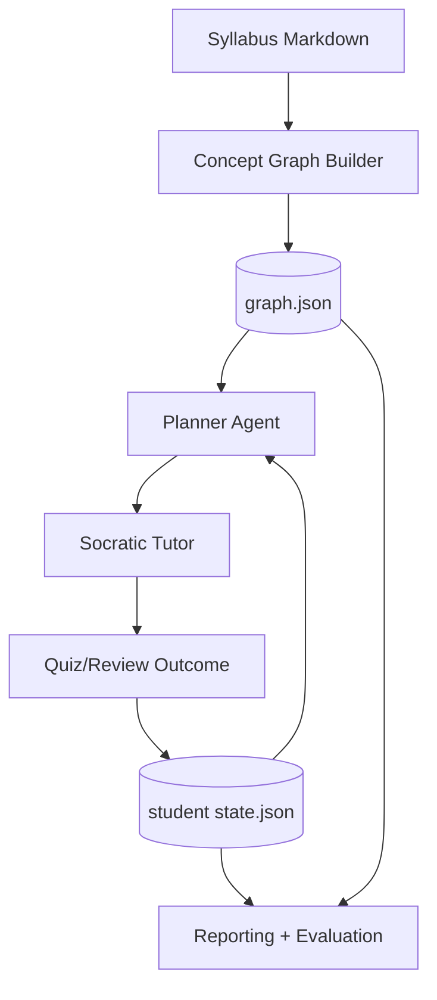

# SkillGraph Tutor


An **offline-first agentic tutoring engine** for tutors, learners, and edtech builders. It builds a concept graph from a syllabus, tracks student mastery with forgetting, plans review using spaced repetition, teaches in Socratic style, and emits progress reports + eval metrics.

## Why this project

SkillGraph Tutor demonstrates practical ML+learning-science engineering:
- concept dependency modeling
- per-student knowledge state updates
- forgetting-aware mastery decay
- SM-2 spaced repetition scheduling
- agentic planning and tutoring styles
- reproducible offline evaluation harness

## Quickstart (offline)

```bash
python -m venv .venv
source .venv/bin/activate
pip install -e .[dev]

skillgraph init data/sample_syllabus.md
skillgraph add-student s1 --name "Ada"
skillgraph study s1 --concept Variables
skillgraph quiz s1 --concept Variables --correct --confidence 0.8
skillgraph review s1
skillgraph plan s1 --horizon 7d
skillgraph report s1 --out reports/s1
```

Or run the scripted walkthrough:

```bash
make demo
```

## CLI

```text
skillgraph init <syllabus.md>
skillgraph add-student <id> --name "..."
skillgraph study <student_id> --concept "..."
skillgraph quiz <student_id> --concept "..." --correct/--no-correct --confidence 0.7
skillgraph review <student_id>
skillgraph plan <student_id> --horizon 7d
skillgraph report <student_id> --out reports/<id>/
skillgraph doctor
```

## Architecture



## Example report snippet

```markdown
## Mastery
| Concept | Mastery | Due |
|---|---:|---|
| Variables | 0.71 | 2026-01-01T00:00:00+00:00 |

## Next 7-Day Plan
- Day 1: review Variables
- Day 2: learn Control Flow
```

## Extend the system

- **Add concepts**: edit `data/sample_syllabus.md` or provide your own syllabus to `skillgraph init`.
- **Add question bank**: update `data/sample_quiz_bank.json`.
- **Add LLM adapter**: implement `BaseLLM` in `tutors.py` (OpenAI optional), keep mock as default.

## Evaluation harness

`skillgraph report ...` also writes:
- `eval_metrics.json`
- `eval_report.md`

Metrics include Socratic-behavior proxies, plan quality proxy, and simulated learning gain.

## Roadmap (Phase 2)

- richer BKT parameter fitting
- adaptive item response model
- retrieval-based hint generation
- web dashboard
- multi-student cohort analytics
