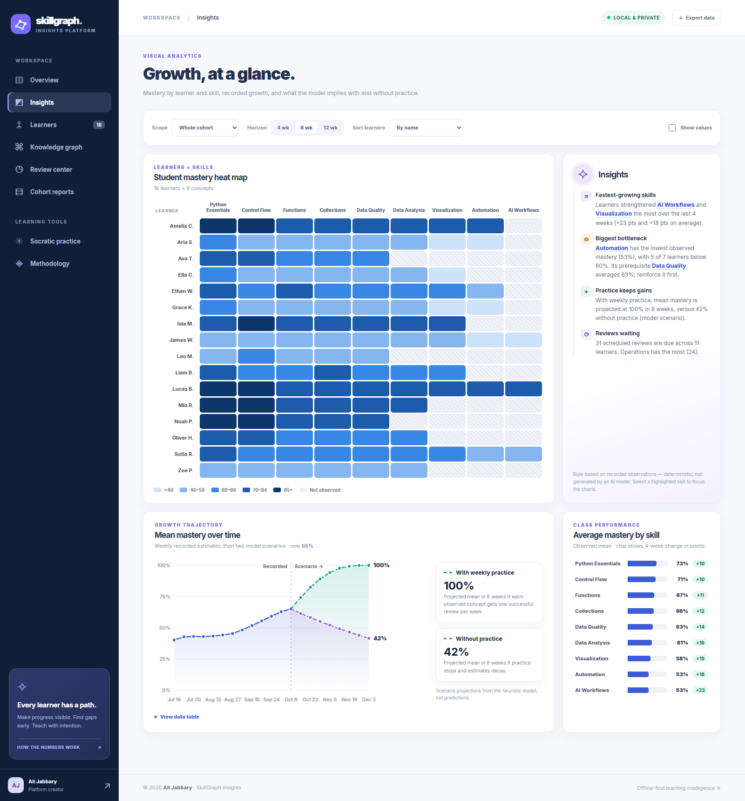
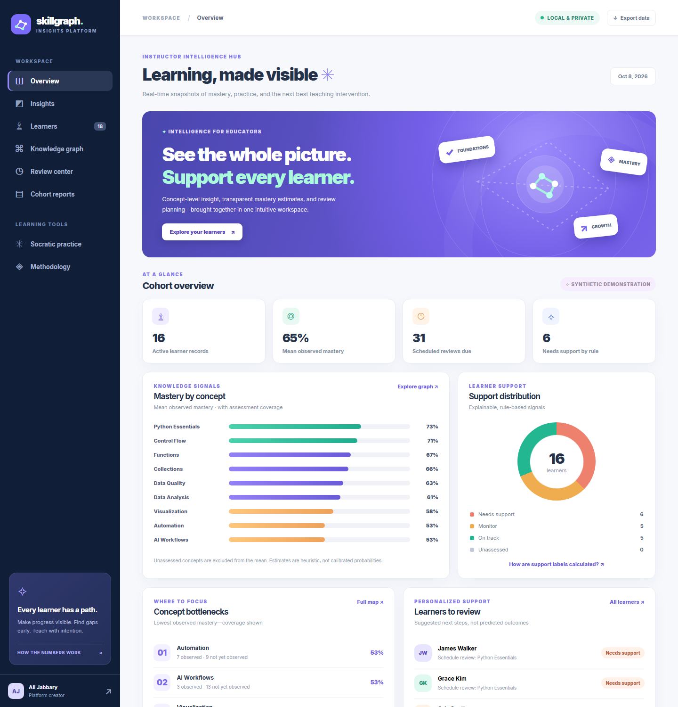
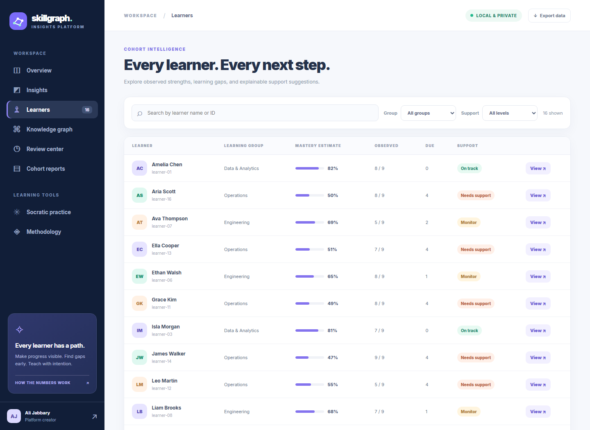
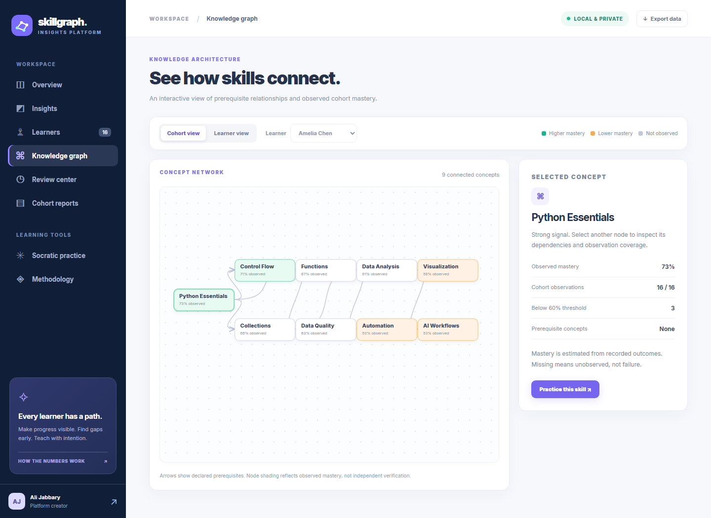
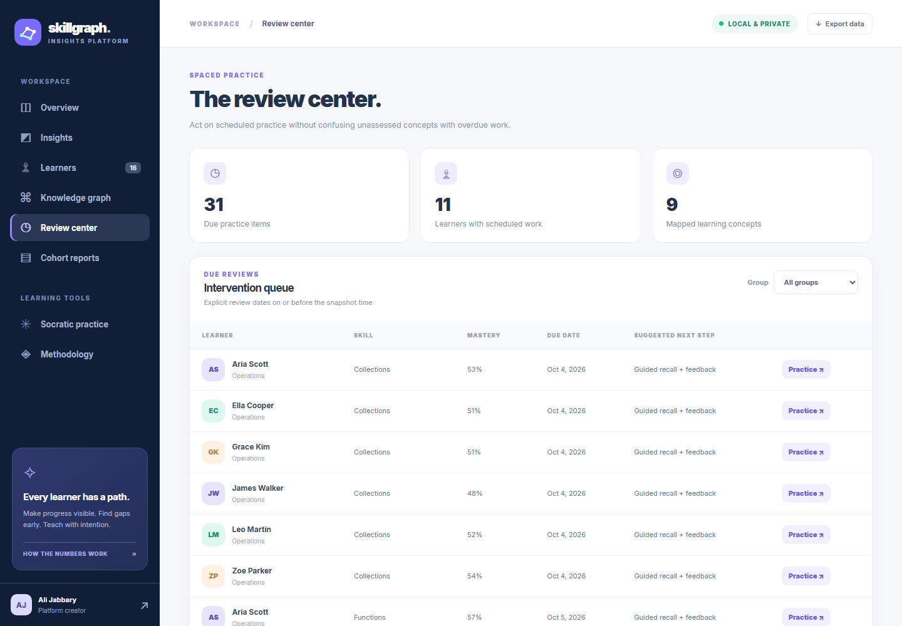

<div align="center">

# SkillGraph

**Offline-first tutoring engine and learning-analytics dashboard.**
Concept graphs, mastery tracking, spaced repetition, and explainable cohort insights, all on your own machine.

[](https://github.com/ali-kin4/skillgraph-tutor/actions/workflows/ci.yml)
[](https://github.com/ali-kin4/skillgraph-tutor/actions/workflows/dashboard-browser.yml)

[](LICENSE)


[Quick start](#quick-start) · [Features](#features) · [How the numbers work](#how-the-numbers-work) · [Architecture](docs/ARCHITECTURE.md) · [Limitations](docs/EVALUATION_AND_LIMITATIONS.md) · [Contributing](CONTRIBUTING.md)



</div>

## Why SkillGraph

Instructors and technical trainers need answers to practical questions: *Which skills has this cohort actually demonstrated? Who has practice due? Where is the bottleneck, and which prerequisite is behind it? What happens if practice stops?*

SkillGraph answers them from a transparent mastery model, without accounts, cloud services, API keys, or telemetry. Every number on screen traces back to a documented rule, and missing observations stay missing instead of being counted as zero.

## Quick start

Requires Python 3.11 or newer.

```bash
git clone https://github.com/ali-kin4/skillgraph-tutor.git
cd skillgraph-tutor
python -m pip install -e .
skillgraph dashboard --demo
```

Open **http://127.0.0.1:8765**. The `--demo` flag creates a reproducible synthetic cohort (16 fictional learners, 3 groups, 9 applied-Python concepts, 12 weeks of history) in `workspace/insights-demo`. Changes you record there persist between runs.

To open your own workspace instead:

```bash
skillgraph init data/sample_syllabus.md      # build graph.json from a Markdown syllabus
skillgraph add-student s1 --name "Ada"
skillgraph dashboard --workspace workspace
```

Every view is deep-linkable, for example `http://127.0.0.1:8765/#insights`.

## Features

### Insights

The view in the screenshot above, scoped to the whole cohort, one learning group, or a single learner:

- **Mastery heat map:** learners × skills on a five-band sequential scale; hatched cells are concepts not yet observed. Sort by name or mastery, toggle cell values, and select any cell to open that learner.
- **Average mastery by skill:** observed mean per skill with the 4-week change in points.
- **Growth trajectory:** 12 weeks of recorded history, then two model scenarios over a 4, 8 or 12-week horizon: *with weekly practice* and *without practice*. Includes a crosshair you can drive with the arrow keys, plus a data-table view.
- **Insights:** deterministic rules covering the fastest-growing skills, the biggest bottleneck and its weakest prerequisite, the scenario gap, and due reviews. Select a highlighted skill to focus both charts on it.

### Instructor workspace

| Overview | Learner explorer |
| --- | --- |
|  |  |
| Cohort KPIs, mastery by concept, support distribution, bottlenecks and the learners to review next. | Search and filter by group or support band, then drill into any learner's concepts and recommendation. |

| Knowledge graph | Review center |
| --- | --- |
|  |  |
| An interactive prerequisite network shaded by cohort or individual mastery. | Reviews whose scheduled date has passed. Concepts that were never scheduled are not treated as overdue. |

Also included:

- **Cohort reports:** per-group summaries and CSV/JSON exports, with spreadsheet formula injection neutralised.
- **Socratic practice:** offline question, hint and next-step templates. Recording a correct or incorrect outcome with a confidence value updates the learner's mastery and their SM-2 review schedule.
- **Methodology:** every calculation and limitation, documented inside the app.

### Engine and CLI

```bash
skillgraph init data/sample_syllabus.md          # syllabus → concept graph
skillgraph add-student s1 --name "Ada"
skillgraph study s1 Variables                    # Socratic question and hint
skillgraph quiz s1 Variables --correct --confidence 0.8
skillgraph quiz s1 Variables --no-correct --confidence 0.6
skillgraph review s1                             # due spaced-repetition items
skillgraph plan s1 --horizon 7d                  # 7-day plan
skillgraph report s1 --out reports/s1            # Markdown + JSON report
skillgraph doctor                                # environment check
skillgraph demo                                  # end-to-end scripted run
```

Engine defaults (seed, forgetting rate, SM-2 parameters, mastery thresholds) live in [`skillgraph.toml`](skillgraph.toml).

## How the numbers work

| Signal | Definition |
| --- | --- |
| **Mastery** | A 0–1 estimate per learner and concept. Each recorded outcome moves it by `learning_rate × confidence` (up if correct, down if not), after exponential forgetting `m · e^(−λ·days)` since the last update. It is a heuristic, not a calibrated probability. |
| **Not observed** | A concept without a recorded state. It is excluded from every mean and shown separately. It is never treated as zero. |
| **Due review** | A review whose explicitly scheduled SM-2 due date is on or before the snapshot time. |
| **Support band** | *Needs support:* 3 or more due reviews, or any mastery below 0.40. *Monitor:* any due review, or 2 or more masteries below 0.60. *On track:* otherwise. *Unassessed:* nothing observed yet. This is a prioritisation rubric, not a risk prediction. |
| **Growth history** | The weekly mean of every learner-concept pair's most recent recorded estimate. The final point equals the current snapshot mean. |
| **Scenarios** | *With practice:* one successful review per observed concept each week at confidence 0.7, applied through each learner's own learning and forgetting rates. *Without practice:* forgetting only. These show what the model implies, not forecasts. |
| **Insights** | Fixed rules over recorded data. No AI model generates them. |

The full audit trail is in [docs/EVALUATION_AND_LIMITATIONS.md](docs/EVALUATION_AND_LIMITATIONS.md).

## Architecture

```text
 Browser (dependency-free HTML · CSS · ES modules · SVG)
   │  same-origin JSON, strict CSP
   ▼
 dashboard_server.py   loopback-only HTTP, allowlisted assets, validated writes
   │
   ├── analytics.py    cohort snapshot, support bands, CSV export
   ├── insights.py     history, scenario projections, growth, insight rules
   │
   ▼
 Engine: graph · student (mastery + history) · scheduler (SM-2) · planner · tutors · reporting
   │
   ▼
 Workspace files: graph.json · students/*.json · cohort_metadata.json
```

| Endpoint | Purpose |
| --- | --- |
| `GET /api/dashboard` | Cohort snapshot with methodology |
| `GET /api/insights?scope=cohort\|group:<name>\|learner:<id>&weeks=1–26` | History, scenarios, growth and insights |
| `GET /api/student?id=<id>` | One learner's state |
| `GET /api/export.csv`, `/api/export.json` | Exports |
| `POST /api/tutor` | Offline Socratic turn (read-only) |
| `POST /api/attempt` | Record an outcome, update mastery and the SM-2 schedule |

Design details are in [docs/ARCHITECTURE.md](docs/ARCHITECTURE.md).

## Security and privacy

- The server binds to `127.0.0.1` only and has **no authentication**. It is a single-user local tool. Do not expose it to a network.
- Writes require JSON, a body under 8 KB, and a same-origin `Origin`. Learner IDs are validated and symlinked files are refused.
- The Content Security Policy only allows scripts and styles from the app itself. The app makes no outbound requests and has no telemetry.
- Use only fictional data or learner records you are authorised to process. The demo cohort is entirely synthetic.

See [SECURITY.md](SECURITY.md) for the security model and how to report a vulnerability.

## Development

```bash
python -m pip install -e ".[dev]"
make check          # ruff lint + format check, pytest, CLI demo
make cov            # tests with coverage
make dashboard      # serve the demo cohort
make screenshots    # regenerate docs/images with a local headless Chrome or Edge
```

CI runs lint, a test matrix (Linux, Windows and macOS on Python 3.11–3.13), a wheel build that verifies the bundled assets, and a Playwright Chromium suite covering every view at desktop and 390px mobile widths. Contribution guidelines are in [CONTRIBUTING.md](CONTRIBUTING.md), and release history is in [CHANGELOG.md](CHANGELOG.md).

```text
src/skillgraph_tutor/
  analytics.py  insights.py  dashboard_server.py  demo_data.py
  graph.py  student.py  scheduler.py  planner.py  tutors.py  reporting.py  cli.py
  web/  index.html  app.js  insights.js  styles.css
tests/        pytest suite + browser-smoke.mjs
scripts/      capture_screenshots.py
docs/         ARCHITECTURE.md  EVALUATION_AND_LIMITATIONS.md  images/
```

## Limitations

SkillGraph is not a hosted LMS. It has no multi-user permissions, audit log, identity verification, or calibrated psychometric model, and its scenarios and support bands have not been validated against real learning outcomes. Read [the evaluation guide](docs/EVALUATION_AND_LIMITATIONS.md) before using it with real learners.

## License

[Apache-2.0](LICENSE) © [Ali Jabbary](https://alijabbary.com)
